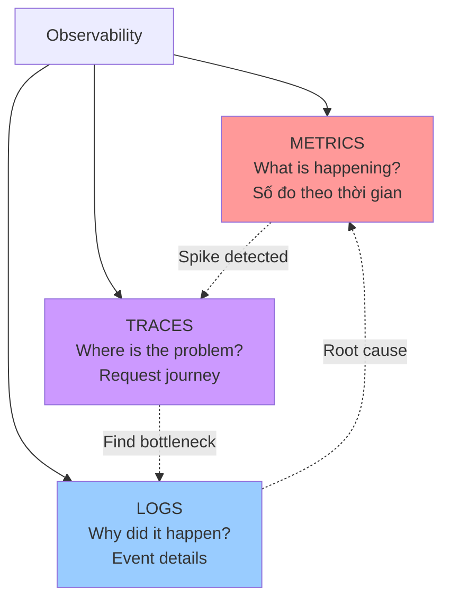
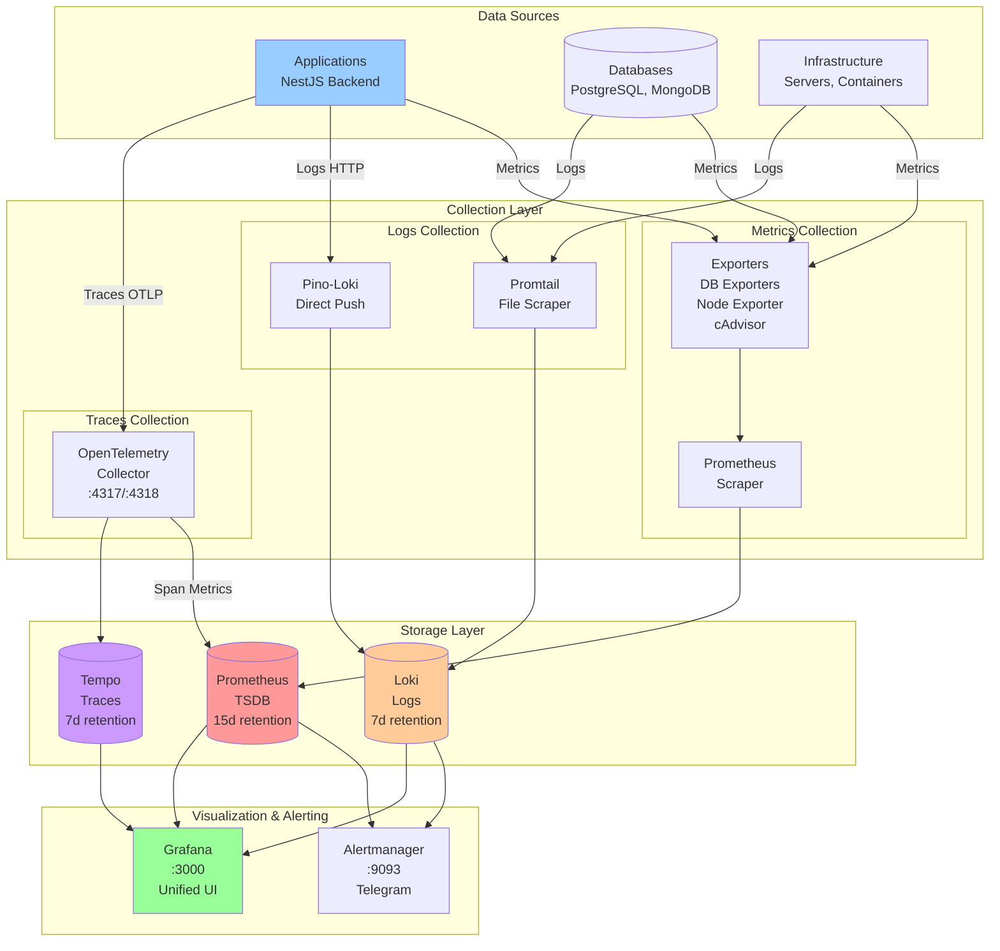
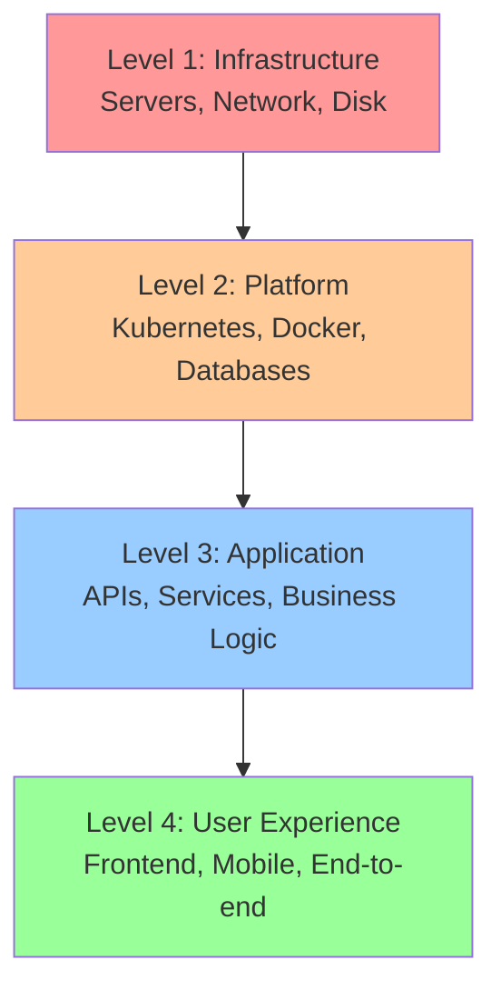

## **Giới thiệu**

Hệ thống monitoring này được xây dựng dựa trên **LGTM Stack** (Loki, Grafana, Tempo, Mimir/Prometheus) - một giải pháp observability toàn diện cho việc giám sát ứng dụng và hạ tầng.

### **Observability là gì?**

**Observability** (khả năng quan sát) là khả năng hiểu được trạng thái nội bộ của hệ thống thông qua các outputs mà nó tạo ra. Khác với monitoring truyền thống (chỉ biết "có vấn đề"), observability giúp bạn **hiểu tại sao** có vấn đề.

### **Ba Trụ cột của Observability**



#### **1\. METRICS - "Hệ thống đang thế nào?"**

**Định nghĩa:** Số đo định lượng theo thời gian (time-series data).

**Ví dụ:**

* CPU usage: 75%
    
* Request rate: 1000 req/s
    
* Error rate: 2%
    
* Response time: 150ms (p95)
    

**Khi nào dùng:**

* Phát hiện vấn đề sớm (CPU tăng dần)
    
* Alerting (error rate &gt; 5%)
    
* Capacity planning (traffic tăng 20%/tháng)
    
* SLA monitoring (99.9% uptime)
    

**Công cụ:** Prometheus + Grafana

---

#### **2\. TRACES - "Request đi đâu và mất bao lâu?"**

**Định nghĩa:** Theo dõi một request khi nó đi qua nhiều services.

**Ví dụ:**

```plaintext
Request: GET /api/order/123 (total: 450ms)
├─ API Gateway: 50ms
├─ Auth Service: 10ms
└─ Order Service: 350ms
   ├─ Database: 30ms
   └─ Payment API: 250ms ← Bottleneck!
```

**Khi nào dùng:**

* Debug microservices (request chậm ở đâu?)
    
* Performance optimization (tìm bottlenecks)
    
* Hiểu service dependencies
    
* Latency breakdown
    

**Công cụ:** OpenTelemetry + Tempo + Grafana

---

#### **3\. LOGS - "Chuyện gì đã xảy ra?"**

**Định nghĩa:** Bản ghi chi tiết về các sự kiện trong hệ thống.

**Ví dụ:**

```json
{
  "timestamp": "2025-12-30T15:30:45Z",
  "level": "ERROR",
  "message": "Payment failed",
  "userId": 123,
  "orderId": "abc-123",
  "error": "Card declined",
  "trace_id": "xyz-789"
}
```

**Khi nào dùng:**

* Debugging chi tiết (stack traces)
    
* Audit trail (ai làm gì, khi nào)
    
* Security investigations
    
* Business analytics
    

**Công cụ:** Loki + Promtail + Grafana

---

### **Workflow Điển hình: Metrics → Traces → Logs**

```mermaid
sequenceDiagram
    participant Dev as Developer
    participant M as Metrics (Prometheus)
    participant T as Traces (Tempo)
    participant L as Logs (Loki)
    
    Note over Dev: User báo: "API chậm!"
    
    Dev->>M: Check metrics
    M-->>Dev: Response time p95: 2s<br/>(spike at 15:30)
    
    Note over Dev: Biết CÓ vấn đề, KHÔNG biết tại sao
    
    Dev->>M: Click exemplar trace
    M->>T: Jump to trace
    T-->>Dev: Trace breakdown:<br/>Payment Service: 1.8s
    
    Note over Dev: Biết vấn đề Ở ĐÂU
    
    Dev->>T: Click Payment Service span
    T->>L: Jump to logs (trace_id)
    L-->>Dev: ERROR: External API timeout<br/>after 1.8s
    
    Note over Dev: Biết TẠI SAO: External API down
```



**Kịch bản thực tế:**

1. **Grafana dashboard** hiển thị spike ở response time (Metrics)
    
2. Click vào spike → Xem **exemplar traces** (Traces)
    
3. Trace cho thấy Payment Service chậm
    
4. Click vào span → Xem **logs** với cùng trace\_id (Logs)
    
5. Logs cho thấy: External payment API timeout
    
6. **Root cause:** Payment gateway đang down
    

## **Kiến trúc Tổng quan**



---

## **Cấu trúc Repository**

```plaintext
monitor-repo/
├── grafana-prometheus/          # LGTM Stack chính
│   ├── prometheus/              # Metrics storage & alerting
│   │   ├── prometheus.yml       # Scrape configs
│   │   ├── rules.alert.yml      # System alerts
│   │   ├── rules.postgres.yml   # PostgreSQL alerts
│   │   └── rules.mongodb.yml    # MongoDB alerts
│   ├── loki/                    # Logs storage
│   │   └── loki-config.yml      # Retention, limits
│   ├── tempo/                   # Traces storage
│   │   └── tempo-config.yml     # Retention, metrics generator
│   ├── otel-collector/          # Traces collection
│   │   └── otel-collector-config.yml
│   ├── promtail/                # Logs collection
│   │   └── promtail-config.yml  # Docker, system, exporters
│   ├── grafana/                 # Visualization
│   │   └── provisioning/        # Datasources, dashboards
│   ├── alertmanager/            # Alert routing
│   └── docker-compose.yml       # Full stack
│
├── db/                          # Database test environment
│   ├── postgres/                # PostgreSQL config
│   │   └── postgresql.conf      # Logging: ALL statements
│   ├── mongodb/                 # MongoDB config
│   │   └── mongod.conf          # Profiling: 100%
│   ├── promtail/                # DB logs collector
│   │   └── promtail-config.yml  # Parse PG & Mongo logs
│   └── docker-compose.yml       # PG, Mongo, Exporters, Promtail
│
├── aisoft-backend/              # NestJS application
│   ├── src/
│   │   ├── common/logger/       # Pino logger service
│   │   └── config/logger.config.ts
│   └── docker-compose.yml       # App + dependencies
```

---

## **Các Thành phần Chính**

### **1\. Prometheus - Metrics Storage**

**Vai trò:** Thu thập và lưu trữ metrics từ các targets.

**Cách hoạt động:**

* **Pull model:** Prometheus scrape metrics từ exporters mỗi 15s
    
* **TSDB:** Time-series database tối ưu cho metrics
    
* **PromQL:** Query language mạnh mẽ
    
* **Alerting:** Đánh giá alert rules và gửi đến Alertmanager
    

**Targets:**

* Prometheus itself (self-monitoring)
    
* Alertmanager
    
* OTEL Collector
    
* Promtail, Loki, Tempo
    
* Node Exporter (system metrics)
    
* cAdvisor (container metrics)
    
* PostgreSQL Exporter
    
* MongoDB Exporter
    

**Port:** 9090

---

### **2\. Loki - Logs Aggregation**

**Vai trò:** Thu thập, lưu trữ và query logs.

**Cách hoạt động:**

* **Label-based indexing:** Chỉ index labels, không index log content
    
* **Cost-effective:** Storage nhỏ hơn Elasticsearch 10-100x
    
* **LogQL:** Query language giống PromQL
    

**Log sources:**

* **Promtail:** Scrape logs từ files (Docker, system, databases)
    
* **Pino-Loki:** Push logs trực tiếp từ application
    

**Retention:** 7 days (configurable)

**Port:** 3100

---

### **3\. Tempo - Distributed Tracing**

**Vai trò:** Lưu trữ và query distributed traces.

**Cách hoạt động:**

* **OTLP receiver:** Nhận traces từ OpenTelemetry
    
* **Trace storage:** Local filesystem hoặc object storage (S3, GCS)
    
* **Metrics generator:** Tạo metrics từ spans (service graphs, span metrics)
    
* **Exemplars:** Link từ metrics → traces
    

**Retention:** 7 days (168h)

**Port:** 3200

---

### **4\. OpenTelemetry Collector - Telemetry Pipeline**

**Vai trò:** Nhận, xử lý, và export telemetry data (traces, metrics, logs).

**Pipeline:**

```plaintext
Receivers → Processors → Exporters
   ↓            ↓            ↓
  OTLP      Batch        Tempo
            Memory       Prometheus
            Limiter
```

**Processors:**

* **Batch:** Gộp data thành batches (hiệu quả network)
    
* **Memory Limiter:** Tránh OOM khi traffic spike
    

**Ports:**

* 4317: OTLP gRPC
    
* 4318: OTLP HTTP
    
* 8889: Prometheus metrics endpoint
    

---

### **5\. Promtail - Log Collector**

**Vai trò:** Thu thập logs từ files và gửi đến Loki.

**Jobs:**

* **docker:** Docker container logs (service discovery)
    
* **system:** System logs (`/var/log`)
    
* **exporters:** Logs từ exporters
    

**Pipeline stages:**

1. **Multiline:** Combine SQL queries
    
2. **Regex/JSON:** Parse log format
    
3. **Labels:** Extract labels
    
4. **Timestamp:** Parse timestamp
    
5. **Drop:** Filter unwanted logs
    

**Port:** 9080 (metrics)

---

### **6\. Grafana - Unified Visualization**

**Vai trò:** Visualization và exploration platform.

**Datasources:**

* Prometheus (metrics)
    
* Loki (logs)
    
* Tempo (traces)
    

**Features:**

* **Dashboards:** Pre-built và custom dashboards
    
* **Explore:** Ad-hoc querying
    
* **Alerting:** Alert rules và notifications
    
* **Correlations:** Jump từ metrics → traces → logs
    

**Port:** 3000

---

### **7\. Alertmanager - Alert Routing**

**Vai trò:** Nhận alerts từ Prometheus/Loki, group, và route đến receivers.

**Features:**

* **Grouping:** Gộp alerts cùng loại
    
* **Inhibition:** Suppress alerts phụ thuộc
    
* **Silencing:** Tắt alerts tạm thời
    
* **Routing:** Gửi đến đúng channel (Telegram, Email, Slack)
    

**Port:** 9093

---

## **Use Cases Thực tế**

### **Use Case 1: Debug Slow API**

**Vấn đề:** API `/api/dashboard` đôi khi chậm (&gt; 2s).

**Workflow:**

1. **Metrics (Prometheus):**
    
    ```plaintext
    histogram_quantile(0.95, 
      rate(http_request_duration_seconds_bucket{endpoint="/api/dashboard"}[5m])
    )
    ```
    
    → Thấy p95 latency = 2.5s
    
2. **Traces (Tempo):**
    
    * Click exemplar trace từ metric spike
        
    * Xem trace breakdown:
        
        ```plaintext
        Total: 2.5s
        ├─ Load user: 50ms
        ├─ Load widgets: 2.2s ← Bottleneck
        └─ Render: 250ms
        ```
        
3. **Logs (Loki):**
    
    ```plaintext
    {service="api"} | json | trace_id="abc-123"
    ```
    
    → Thấy: N+1 query problem trong `load widgets`
    
4. **Fix:** Optimize query với JOIN
    
5. **Verify:**
    
    * Metrics: p95 latency giảm xuống 400ms
        
    * Traces: Load widgets chỉ còn 150ms
        

---

### **Use Case 2: Database Performance**

**Vấn đề:** PostgreSQL slow queries.

**Workflow:**

1. **Metrics:**
    
    ```plaintext
    pg_stat_activity_max_tx_duration{state="active"} > 300
    ```
    
    → Alert: Query chạy &gt; 5 phút
    
2. **Logs:**
    
    ```plaintext
    {service="postgresql"} |= "duration:" | regexp "duration: (?P<duration>\\d+) ms" | duration > 5000
    ```
    
    → Thấy query cụ thể:
    
    ```sql
    SELECT * FROM orders WHERE user_id IN (...)
    -- 50,000 rows scanned
    ```
    
3. **Metrics (Table stats):**
    
    ```plaintext
    pg_stat_user_tables_seq_scan{relname="orders"} 
    / 
    (pg_stat_user_tables_seq_scan + pg_stat_user_tables_idx_scan)
    ```
    
    → Sequential scan ratio = 0.8 (80% seq scans)
    
4. **Fix:** Thêm index trên `user_id`
    
5. **Verify:**
    
    * Metrics: Seq scan ratio giảm xuống 0.1
        
    * Logs: Query duration &lt; 100ms
        

---

### **Use Case 3: Application Error Spike**

**Vấn đề:** Error rate tăng đột ngột.

**Workflow:**

1. **Metrics:**
    
    ```plaintext
    rate(http_requests_total{status=~"5.."}[5m])
    ```
    
    → 50 errors/second (bình thường: 1/second)
    
2. **Logs (Error messages):**
    
    ```plaintext
    {service="api", level="error"} | json | line_format "{{.error}}"
    ```
    
    → Top errors:
    
    ```plaintext
    Database connection timeout: 45%
    Redis connection refused: 30%
    External API timeout: 25%
    ```
    
3. **Traces (Failed requests):**
    
    ```plaintext
    {status = error}
    ```
    
    → Thấy tất cả traces fail ở Database connection
    
4. **Metrics (Database):**
    
    ```plaintext
    pg_stat_activity_count{state="active"}
    ```
    
    → 100 connections (max = 100)
    
5. **Root cause:** Connection pool exhausted
    
6. **Fix:** Tăng connection pool size + fix connection leaks
    

---

## **Monitoring Strategy**

### **Monitoring Levels**



**Level 1: Infrastructure**

* **Metrics:** CPU, Memory, Disk, Network
    
* **Tools:** Node Exporter, cAdvisor
    
* **Alerts:** Disk &gt; 90%, CPU &gt; 90%, Memory &gt; 80%
    

**Level 2: Platform**

* **Metrics:** Container stats, DB connections, Cache hit ratio
    
* **Tools:** PostgreSQL Exporter, MongoDB Exporter, Redis Exporter
    
* **Alerts:** DB connections &gt; 90%, Slow queries, Replication lag
    

**Level 3: Application**

* **Metrics:** Request rate, Error rate, Latency (RED)
    
* **Traces:** Request flow, Service dependencies
    
* **Logs:** Application errors, Business events
    
* **Alerts:** Error rate &gt; 5%, p95 latency &gt; 500ms
    

**Level 4: User Experience**

* **Metrics:** Page load time, API response time
    
* **Traces:** End-to-end request tracing
    
* **Logs:** User actions, Conversion funnel
    

---

### **Golden Signals (Google SRE)**

**4 metrics quan trọng nhất:**

1. **Latency:** Thời gian xử lý request
    
    ```plaintext
    histogram_quantile(0.95, rate(http_request_duration_seconds_bucket[5m]))
    ```
    
2. **Traffic:** Request rate
    
    ```plaintext
    rate(http_requests_total[5m])
    ```
    
3. **Errors:** Error rate
    
    ```plaintext
    rate(http_requests_total{status=~"5.."}[5m]) 
    / 
    rate(http_requests_total[5m])
    ```
    
4. **Saturation:** Resource utilization
    
    ```plaintext
    1 - (node_memory_MemAvailable_bytes / node_memory_MemTotal_bytes)
    ```
    

---

## **Getting Started**

### **1\. Start LGTM Stack**

```bash
cd grafana-prometheus
docker-compose up -d

# Verify
docker-compose ps
curl http://localhost:9090  # Prometheus
curl http://localhost:3100  # Loki
curl http://localhost:3200  # Tempo
curl http://localhost:3000  # Grafana
```

### **2\. Start Database Test Environment**

```bash
cd db
cp .env.example .env
docker-compose up -d

# Verify
docker-compose ps
curl http://localhost:9187/metrics  # PostgreSQL Exporter
curl http://localhost:9216/metrics  # MongoDB Exporter
```

### **3\. Start Application**

```bash
cd aisoft-backend
npm install
npm start

# Logs sẽ tự động gửi đến Loki
```

### **4\. Access Grafana**

```plaintext
URL: http://localhost:3000
Username: admin
Password: (check docker-compose.yml)
```

**Explore:**

* Metrics: Prometheus datasource
    
* Logs: Loki datasource
    
* Traces: Tempo datasource
    

---

## **Key Takeaways**

**Observability = Metrics + Traces + Logs**  
**Metrics:** Phát hiện vấn đề (What?)  
**Traces:** Tìm bottleneck (Where?)  
**Logs:** Root cause analysis (Why?)  
**LGTM Stack:** Loki + Grafana + Tempo + Prometheus  
**Unified UI:** Grafana cho tất cả datasources  
**Correlation:** Jump giữa metrics ↔ traces ↔ logs  
**Cost-effective:** Open-source, self-hosted